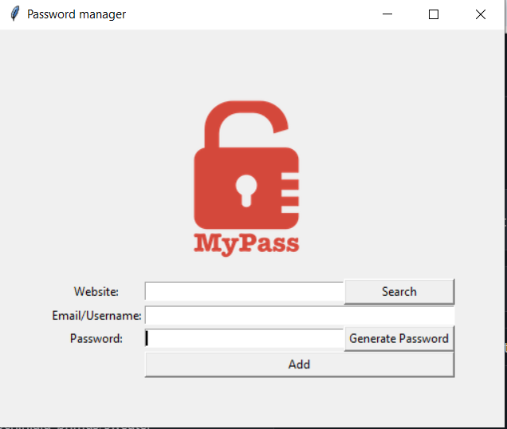
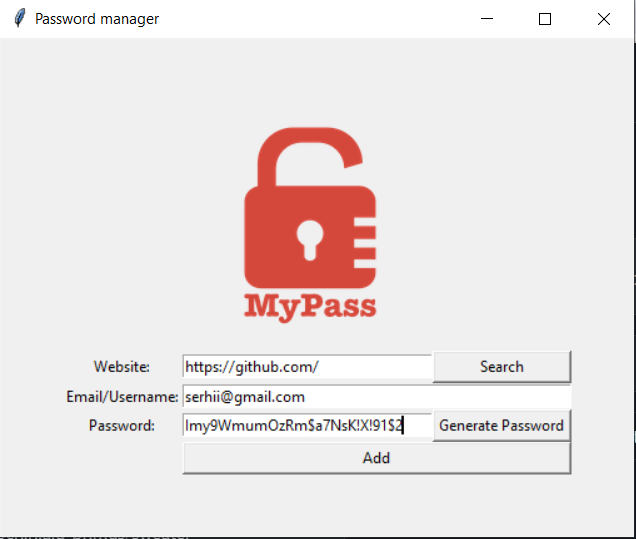
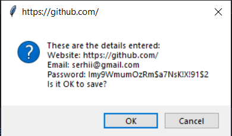
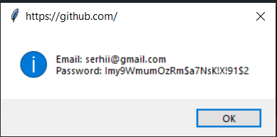

# Password Manager

A simple password manager application created using **Python** and **Tkinter** for the GUI.
It allows users to store, search, and generate passwords securely.
The application saves user data in a `data.json` file.

## Features

- **Password Generation**: Generate strong passwords with random letters, numbers, and symbols.
- **Save Passwords**: Save passwords with associated website names and emails.
- **Find Passwords**: Search for and retrieve passwords for specific websites.
- **Clipboard Support**: Automatically copies the generated password to the clipboard for easy pasting.

## Technologies

**Python 3.12.2**

- **Tkinter (GUI)**
- **JSON (for data storage)**

## Example of data.json

## Example of `data.json`

```json
{
  "https://github.com/": {
    "email": "serhii@gmail.com",
    "password": "Imy9WmumOzRm$a7NsK!X!91$2"
  }
}
```




